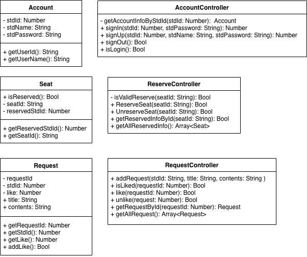
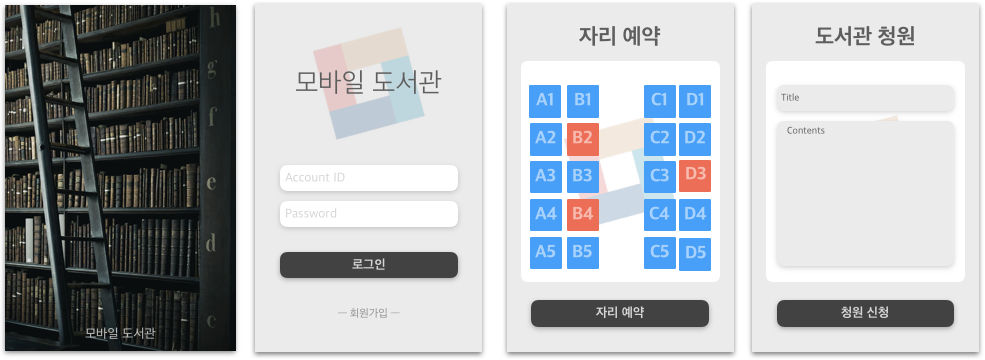

## **1. 개발 배경**
스마트폰 사용자가 90% 이상이 된 현재 모바일 세상에 살고있다. 이 사회의 흐름에 따라 학교 도서관의 서비스를 모바일에서도 사용가능하게 개발해보려고 한다.

## **2. 개발의 목표 및 내용**
### 2.1. 최종 목표 및 내용

> 본 Term Project는 다음 기능을 구현하는 것을 목표로 한다.

1. 회원 관리
    - 로그인 (Sign In)
    - 회원가입 (Sign Up)
    - 로그아웃 (Sign Out)
2.  도서관 자리예약 서비스
    - 자리 예약 상태 확인 (Valid Seat Check)
    - 자리 예약 (Reserved Seat)
    - 자리 예약 취소 (Unreserved Seat)
3. 도서관 청원 시스템 (Lib Request System)
    - 청원 신청 (Request)
    - 청원 공감 (Request Like)
    - 청원 공감 취소 (Request Unlike)

#### Class Diagram
> 상기 작성한 기능을 구현하기 위한 클래스 다이어그램

    

#### UI
> 본 안드로이드 어플리케이션의 계발 예상 화면

### 2.2. 설계 과정
> 본 프로젝트의 설계 과정

1. 서비스 기능 기획
2. DataBase 스키마 설계
3. UI 코드(XML) 작성
4. 시스템 코드(Java) 작성
5. 디버깅 (Debugging) 
6. 결과물 평가 지표 검증
7. 프로젝트 종료

### 2.3. 세부 개발 내용

- **개발 환경:** MacOs
- **개발 IDE:** Android Studio
- **개발 버전:** 28 API(Android)
- **테스트 장치:** VM(nexus 5)

## **3. 결과물 평가 항목**
|순번|평가항목|목표|
|---|--|--|
|01|중복 학번을 통한 회원가입|회원가입 실패|
|02|정상적인 회원가입|회원가입 성공|
|03|정상적인 로그인|로그인 실패|
|04|존재하지 않는 계정으로 로그인|로그인 실패|
|05|일치하지 않는 비밀번호로 로그인|로그인 실패|
|06|도서관 자료 조회|조회 성공|
|07|예약된 자리 예약|예약 실패|
|08|본인이 예약한 자리 예약 취소|취소 성공|
|09|타인이 예약한 자리 예약 취소|취소 실패|
|10|청원 조회|조회 성공|
|11|정상적인 청원 신청|신청 완료|
|12|빈 제목 혹은 빈 내용의 청원 신청|신청 실패|
|13|정상적인 청원 공감|공감 성공|
|14|공감한 청원를 공감|공감 실패|
|15|정상적인 청원 공감 취소|공감 취소 성공|
|16|공감하지 않은 청원를 공감취소|공감 취소 실패|

## **4. 활용성 및 기대효과**
- 시스템화된 도서관 자리 시스템을 통한 도서관 활성화 및 학생이 학업 증진
- 학교 및 도서관에 대한 학생과의 요구를 공유함으로서 도서관 개선

## **5. 참고할 기술 및 자료**
> 프로젝트 진행시 참고할 기술
- SQLite
- Android Cache
- Android 교재