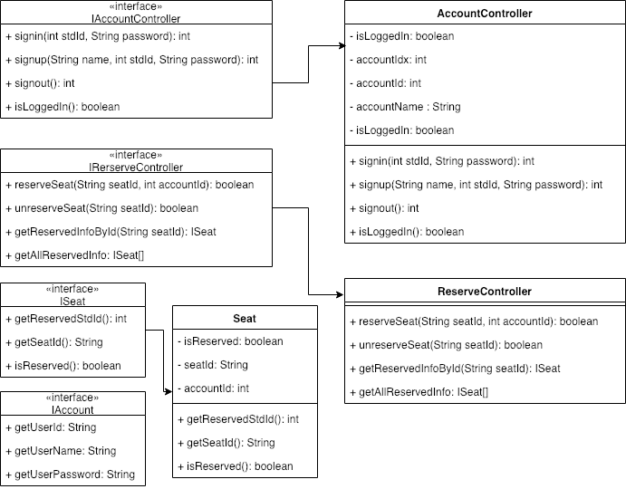
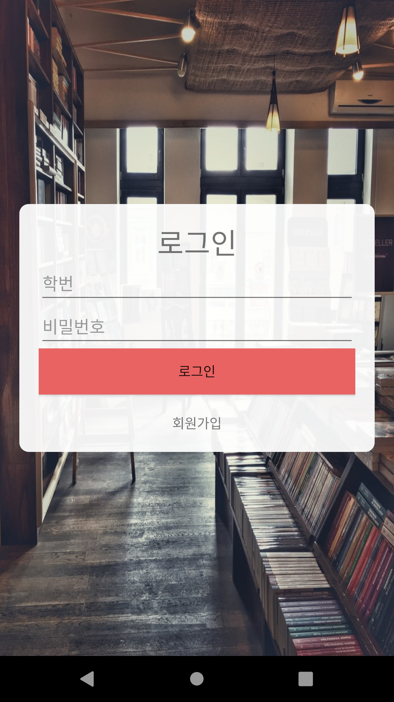
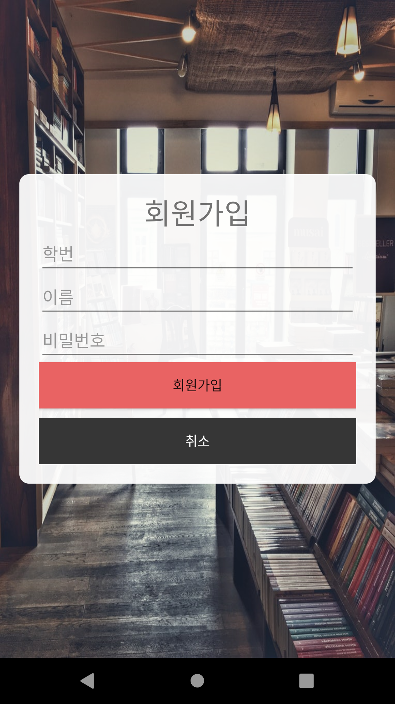
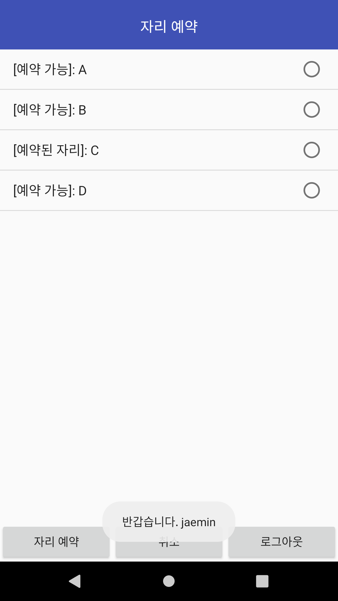
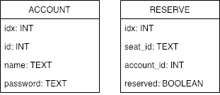
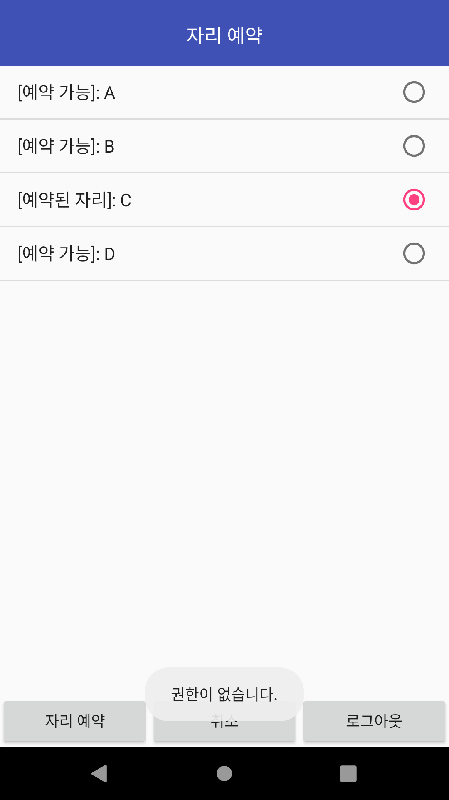
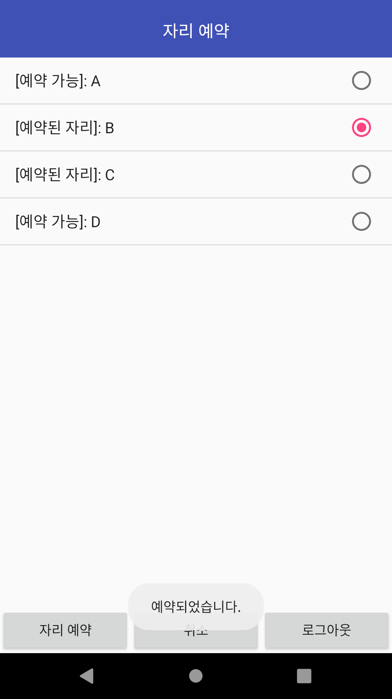
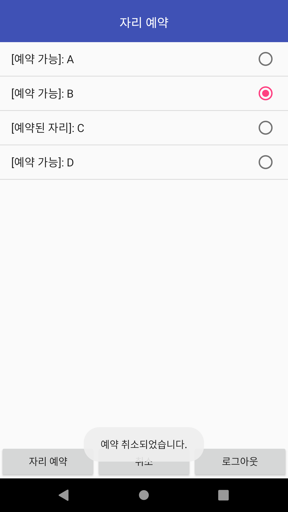
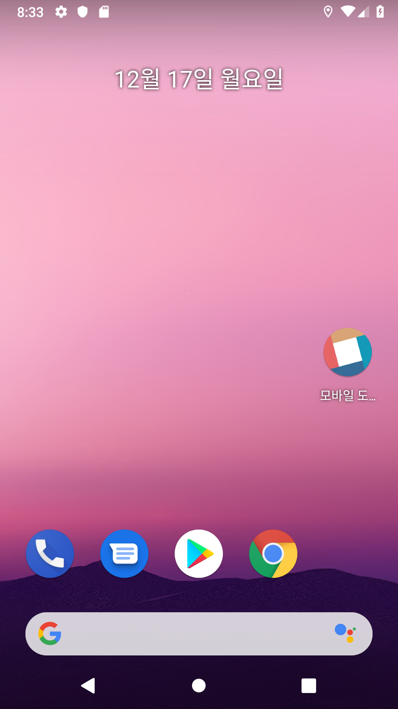

<p align="center">
    
</p>

<h1 align="center">Develoment Report</h1>
<p align="center">[ANDROID PROGRAMMING] Term Project</p>

## **1. 개발 배경**
스마트폰 사용자가 90% 이상이 된 현재 모바일 세상에 살고있다. 이 사회의 흐름에 따라 학교 도서관의 서비스를 모바일에서도 사용가능하게 개발해보려고 한다.

## **2. 개발의 목표 및 내용**
### 2.1. 최종 목표 및 내용

> 본 Term Project는 다음 기능을 구현하는 것을 목표로 한다.

1. 회원 관리
    - 로그인 (Sign In)
    - 회원가입 (Sign Up)
    - 로그아웃 (Sign Out)
2.  도서관 자리예약 서비스
    - 자리 예약 상태 확인 (Valid Seat Check)
    - 자리 예약 (Reserved Seat)
    - 자리 예약 취소 (Unreserved Seat)

### 2.2. 설계 과정

- **개발 환경:** MacOs
- **개발 IDE:** Android Studio
- **개발 버전:** 28 API(Android)
- **테스트 장치:** VM(nexus 5)

#### USE
- List View
- Adaptor
- Toast
- SQLite
- Intent
- Permission
- Interface
- i13n (en-us, ko-kr)

### 2.3. 세부 개발 내용
1. 구조 설계하기

    모바일 자리 예약 시스템을 구현하기 위해 시스템 구조를 설계하고 다음과 같이 UML로 작성했습니다.
<p ALIGN="CENTER">

</p>

2. 프로젝트 구조화 하기 

    프로젝트 중간 중간에 생길 수 있는 개발 이슈를 원활하게 해결하기 위해 다음과 같이 클래스와 디렉토리를 분류하여 설계하였습니다.
```
.
├── AndroidManifest.xml
├── java
│   └── me
│       └── j911
│           └── term_project
│               └── mobile_library
│                   ├── Reserve.java
│                   ├── SignIn.java
│                   ├── SignUp.java
│                   ├── Splash.java
│                   ├── controller
│                   │   ├── AccountController.java
│                   │   └── ReserveController.java
│                   ├── entites
│                   │   └── Seat.java
│                   ├── helper
│                   │   └── DBHelper.java
│                   └── interfaces
│                       ├── IAccount.java
│                       ├── IAccountController.java
│                       ├── IReserveController.java
│                       └── ISeat.java
└── res
    ├── drawable
    │   ├── background.jpeg
    │   ├── rounded.xml
    │   └── splash.png
    ├── layout
    │   ├── reservescreen.xml
    │   ├── signinscreen.xml
    │   ├── signupscreen.xml
    │   └── splashscreen.xml
    ├── values
    │   ├── colors.xml
    │   ├── strings.xml
    │   └── styles.xml
    └── values-ko
        └── strings.xml

21 directories, 38 files

```

3. 유저 인터페이스 작성하기
    다음과 같이 유저 인터페이스를 작성했습니다.
<p ALIGN="CENTER">




</p>
<p ALIGN="CENTER">(왼쪽 부터 스플래시, 로그인, 회원가입, 자리예약)</p>

4. 데이터베이스 설계 
    실제 구동 가능한 시스템을 개발하기 위하여 간단하게 다음과 같은 데이터베이스를 설계하였습니다.
    <p ALIGN="CENTER">
    
    </p>
5. 기능 구현하기 

    다음과 같은 기능을 구현하였습니다. 
    
    **Account 관련**    
    - public String getUserId()
    - public String getUserName()
    - public String getUserPassword()
    - public int signin(int stdId, String stdPassword)
    - public int signup(String stdName, int stdId, String stdPassword)
    - public int signout()
    - public boolean isLoggedIn()

    **Reserve 관련**    
    - public boolean reserveSeat(String seatId, int accountId)
    - public boolean unreserveSeat(String seatId)
    - public ISeat getReservedInfoById(String seatId)
    - public ISeat[] getAllReservedInfo()
    - public int getReservedStdId()
    - public String getSeatId()
    - public boolean isReserved()

    ** 자세한 내용은 **3.1 소스코드 분석 참고**

## **3. 개발 결과**
### 3.1. 소스코드 분석
#### SQLite 연동
본 시스템을 개발하기 위해선 데이터베이스 연동이 필수적이였다. 따라서 안드로이드에 기본 내장되어있는 `SQLite`를 활용해 개발을 준비했다. 
그렇게 하여 다음과 같이 데이터베이스를 제어하는 `DBHelper`클래스를 작성하게 되었다.

```java
package me.j911.term_project.mobile_library.helper;

public class DBHelper extends SQLiteOpenHelper { // SQLite를 사용하기 위해서는 SQLiteOpenHelper 클래스를 상속 받아서 사용해야 한다.

    private SQLiteDatabase db;

    public DBHelper(Context context, String name, SQLiteDatabase.CursorFactory factory, int version) {
        super(context, name, factory, version); // SQLiteOpenHelper의 생성자에 Context를 입력하여 호출한다. 
    }

    @Override
    public void onCreate(SQLiteDatabase db) { // 초기 데이터베이스를 호출할 때 실행되는 함수로 앱이 설치되고 최초 실행에서만 실행된다.
        this.db = db;
        initializeTables(); // 데이터베이스 테이블을 초기화 하기 위해 만든 메서드
    }

    private void initializeTables() {
        db.execSQL("CREATE TABLE ACCOUNT (idx INTEGER PRIMARY KEY AUTOINCREMENT, id INTEGER, name TEXT, password TEXT);"); // 유저 관련 테이블을 생성한다.
        db.execSQL("CREATE TABLE RESERVE (idx INTEGER PRIMARY KEY AUTOINCREMENT, seat_id TEXT, account_id INTEGER, reserved TINYINT(1) DEFAULT 0);"); // 자리 예약과 관련돤 테이블을 생성한다.
        db.execSQL("INSERT INTO RESERVE (seat_id, account_id) VALUES('A-1', '')"); // 기본적인 자리정보를 테이블에 삽입한다.
        // (...) 생략
        db.execSQL("INSERT INTO RESERVE (seat_id, account_id) VALUES('A-8', '')");
    }

    @Override
    public void onUpgrade(SQLiteDatabase db, int oldVersion, int newVersion) { } 

}
```

#### AccountController
회원관리를 위한 컨트롤러 클래스를 작성했다.
```java
package me.j911.term_project.mobile_library.controller;

public class AccountController implements IAccountController { // Interface를 구현한다. (참조: me/j911/term-project/mobile-lib/interface)

    private static AccountController instance; // 싱글톤 패턴을 구현하기 위한 스태틱 인스턴스 선언

    private boolean isLoggedIn; // 로그인 유무를 저장할 변수 선언
    private DBHelper dbHelper; // DB 컨트롤러 객체를 담을 변수 선언
    private SQLiteDatabase db; // 쿼리문을 전송할 수 있는 인스턴스 변수 선언

    private int accountIdx; // 유저 인덱스를 담을 변수 선언
    private int accountId; // 유저 아이디(학번)을 담을 변수 선언
    private String accountName; // 유저 이름을 담을 변수 선언

    public String dbName = "account.db"; // 사용할 데이터베이스 파일 이름 지정
    public int dbVersion = 1; // 데이터 버전 정보
    public String tag = "SQLite"; // Log.d로 로그 님길때 사용할 태그

    public AccountController(Context context) { // AccountController생성자
        isLoggedIn = false; // 처음 로그인 상태는 false로 지정
        dbHelper = new DBHelper(context, dbName, null, dbVersion); // DBHelper 인스턴스 생성
        try {
            db = dbHelper.getWritableDatabase(); // db 객체를 DBHelper를 통해 생성
        } catch (SQLiteException e) {
            e.printStackTrace(); // 에러시 에러 출력
            Log.e(tag, "database error"); // 데이터베이스 에러 메세지 출력
        }
    }

    @Override
    public int signin(int stdId, String stdPassword) { // 로그인 기능 구현
        String VALID_CHECK_SQL = "SELECT * FROM ACCOUNT WHERE id = " + stdId + ";"; // stdId로 account를 조회하는 SQL문
        Cursor cursor = db.rawQuery(VALID_CHECK_SQL, null); // SQL 질의
        if (!cursor.moveToNext()) return 404; // 데이터가 없을 시 404 리턴

        String password = cursor.getString(3); // password를 저장
        if (!stdPassword.equals(password)) return 403; // 암호가 불일치시 403 리턴

        accountIdx = cursor.getInt(0); // 사용자 인덱스 저장
        accountId = cursor.getInt(1); // 사용자 아이디 저장
        accountName = cursor.getString(2); // 사용자 이름 저장
        isLoggedIn = true; // 로그인 상태를 true로 변경
        return 200; // 200을 리턴
    }

    @Override
    public int signup(String stdName, int stdId, String stdPassword) { // 회원가입 구현
        String CONFLICT_CHECK_SQL = "SELECT * FROM ACCOUNT WHERE id = " + stdId + ";"; // 아이디가 존재하는지 확인하는 SQL문
        Cursor cursor = db.rawQuery(CONFLICT_CHECK_SQL, null); // 질의
        if (cursor.moveToNext()) return 409; // 계정이 존재하면 409 Conflict 리턴

        String INSERT_ACCOUNT_SQL = "INSERT INTO ACCOUNT (id, name, password) VALUES("+stdId+", '"+ stdName +"', '"+ stdPassword +"');"; // 계정을 추가하는 SQL문
        db.execSQL(INSERT_ACCOUNT_SQL); // 질의
        return 201; // 201 리턴
    }

    @Override
    public int signout() { // 로그아웃 구현
        isLoggedIn = false; // 로그인 상태를 false로 변경
        accountName = null; // 계정 정보를 초기화함
        accountId = 0; // 계정 정보를 초기화함
        accountIdx = 0; // 계정 정보를 초기화함
        return 200; // 200 리턴
    }

    @Override
    public boolean isLoggedIn() { // 로그인 여부를 확인
        return isLoggedIn;
    }

    public int getAccountIdx() { // 계정 인덱스를 확인
        return accountIdx;
    }

    public int getAccountId() { // 계정 아이디를 확인
        return accountId;
    }

    public String getAccountName() { // 계정 이름을 확인
        return accountName;
    }

    public static AccountController getInstance (Context context) { // 싱글톤을 구현하기 위한 Instance 호출 메서드
        if (instance == null) { // 인스턴스가 없으면
            instance = new AccountController(context); // 인스턴스 생성
        }
        return instance; // 인스턴스 반환
    }


}

```
#### ReserveController
자리예약 관리를 위한 컨트롤러 클래스를 작성했다.

```java
package me.j911.term_project.mobile_library.controller;

public class ReserveController implements IReserveController { // Interface를 구현한다. (참조: me/j911/term-project/mobile-lib/interface)
    private static ReserveController instance; // 싱글톤 패턴을 구현하기 위한 스태틱 인스턴스 선언

    private DBHelper dbHelper; // DB 컨트롤러 객체를 담을 변수 선언
    private SQLiteDatabase db;// 쿼리문을 전송할 수 있는 인스턴스 변수 선언

    public String dbName = "reserve.db"; // 사용할 데이터베이스 파일 이름 지정
    public int dbVersion = 1; // 데이터 버전 정보
    public String tag = "SQLite"; // Log.d로 로그 님길때 사용할 태그

    public ReserveController(Context context) { // ReserveController 생성자
         dbHelper = new DBHelper(context, dbName, null, dbVersion); // DBHelper 인스턴스 생성
        try {
            db = dbHelper.getWritableDatabase(); // db 객체를 DBHelper를 통해 생성
        } catch (SQLiteException e) {
            e.printStackTrace(); // 에러시 에러 출력
            Log.e(tag, "database error"); // 데이터베이스 에러 메세지 출력
        }
    }

    @Override
    public boolean unreserveSeat(String seatId) { // 자리 예약을 취소하는 메서트
        String UNRESERVE_SEAT = "UPDATE RESERVE SET reserved = 0 WHERE seat_id = '"+seatId+"'"; // 자리 예약을 취소하는 SQL문
        db.execSQL(UNRESERVE_SEAT); // 질의
        return true; // 성공 반환
    }

    @Override
    public Seat getReservedInfoById(String seatId) { // Seat ID를 통해 자리 정보를 받은 메서트
        String GET_ALL_RESERVED = "SELECT * FROM RESERVE WHERE seat_id = '"+seatId+"'"; // 자리정보를 검색하는 SQL문
        Cursor cursor = db.rawQuery(GET_ALL_RESERVED, null); // 질의
        if (!cursor.moveToNext()) return null; // 값이 비여있으면 null반환
        int accountId = cursor.getInt(2); // accountId 초기화
        boolean isReserve = cursor.getInt(3) != 0; // 예약 유무 초기화
        Seat seat = new Seat(seatId, accountId, isReserve); // 반환할 자리 객체 선언

        return seat; // 자리 반환
    }

    @Override
    public Seat[] getAllReservedInfo() { // 모든 자리 정보를 조회
        String GET_ALL_RESERVED_INFO = "SELECT * FROM RESERVE"; // 자리정보를 검색하는 SQL문
        Cursor cursor = db.rawQuery(GET_ALL_RESERVED_INFO, null); // 잘의
        Seat[] seats = new Seat[cursor.getCount()]; // 조회 개수만큼의 자리 배열 선언
        while (cursor.moveToNext()) { // 레코드를 넘기며 반복
            String seatId = cursor.getString(1); // 자리 아이디 저장
            int accountId = cursor.getInt(2); // 자리 예약자 저장
            boolean isReserve = cursor.getInt(3) != 0; // 예약 유무 저장
            seats[cursor.getPosition()] = new Seat(seatId, accountId, isReserve); // 객체 선언
        }
        return seats; // 자리 정보 반환
    }

    @Override
    public boolean reserveSeat(String seatId, int accountId) { // 자리를 예약하는 메서트
        String RESERVE_SEAT = "UPDATE RESERVE SET reserved = 1, account_id = "+ accountId +" WHERE seat_id = '"+seatId+"'"; // 자리를 예약하는 SQL문
        db.execSQL(RESERVE_SEAT); //질의 
        return true; // true 반환
    }

    public static ReserveController getInstance(Context context) { // 싱글톤을 구현하기 위한 Instance 호출 메서드 
        if (instance == null) { // 인스턴스가 없으면
            instance = new ReserveController(context); // 인스턴스 생성
        }
        return instance; // 인스턴스 반환
    }
}

```

#### Seat
자리정보를 담기 위한 클래스를 작성했다.

```java
package me.j911.term_project.mobile_library.entites;

public class Seat implements ISeat { // Interface를 구현한다. (참조: me/j911/term-project/mobile-lib/interface)

    private boolean isReserved; // 자리 예약 유무
    private String seatId; // 자리 아이디
    private int accountId; // 예약자 아이디

    public Seat(String seatId, int accountId, boolean isReserved) { // 자리 생성자
        this.seatId = seatId; // 자리 아이디 초기회
        this.accountId = accountId; // 예약자 아이디 초기화
        this.isReserved = isReserved; // 예약 유무 초기화
    }

    @Override
    public int getReservedStdId() { // 예약자 아이디 조회
        return accountId;
    }

    @Override
    public String getSeatId() { // 자리 아이디 조회
        return seatId;
    }

    @Override
    public boolean isReserved() { // 자리 예약 유무 조회
        return isReserved;
    }
}

```


#### Splash, SplashScreen
초기 로딩 화면을 구현하기 위한 화면과 클래스 생성

```java
package me.j911.term_project.mobile_library;

public class Splash extends Activity {

    private final int SPLASH_DISPLAY_LENGTH = 3000; // 디스플레이 시간

    @Override
    public void onCreate(Bundle savedInstanceState) {
        super.onCreate(savedInstanceState);
        setContentView(R.layout.splashscreen);

        new Handler().postDelayed(new Runnable(){ // 지정된 시간 이후 실행
            @Override
            public void run() {
                Intent loginIntent = new Intent(Splash.this, SignIn.class); // 페이지 이동 인텐트 생성
                Splash.this.startActivity(loginIntent); // 인텐트 실행
                Splash.this.finish(); // 다음 인텐트 종료시 해당 컴포넌트도 종료
            }
        }, SPLASH_DISPLAY_LENGTH); // 시간 설정
    }
}
```

```xml
<?xml version="1.0" encoding="utf-8"?>
<LinearLayout xmlns:android="http://schemas.android.com/apk/res/android"
    android:layout_width="match_parent"
    android:layout_height="match_parent"
    android:orientation="vertical" // vertical 모드
    android:padding="0dp">

    <ImageView
        android:id="@+id/splashscreen"
        android:layout_width="match_parent"
        android:layout_height="0dp"
        android:layout_gravity="top"
        android:layout_weight="1" // 가중치 1로 설정
        android:adjustViewBounds="true"
        android:background="@drawable/splash" // 배경이미지 설정
        android:cropToPadding="false"
        android:scaleType="centerCrop" // 화면을 꽉차게 하기위해 설정
        android:src="@drawable/splash" />

    <TextView
        android:id="@+id/footer" // 바닥글
        android:layout_width="match_parent"
        android:layout_height="wrap_content"
        android:background="@android:color/background_dark" // 배경 색상을 설정
        android:gravity="bottom" // 바닥에 붙게 설정
        android:text="@string/footer"
        android:textAlignment="center" // 정렬을 가운데 정렬로 설정
        android:textColor="@android:color/darker_gray" /> // 폰트 색상을 설정
</LinearLayout>
```

#### Signin
로그인을 구현하기 위한 클래스 생성
```java
package me.j911.term_project.mobile_library;

public class SignIn extends AppCompatActivity {

    private AccountController accountController; // AccountController를 담을 객체 변수 선언
    private EditText stdIdInput; // id입력창을 선언
    private EditText stdPwInput; // pw입력창을 선언
    private Button signInButton; // 로그인 버튼을 선언
    private TextView signUpButton; // 회원가입 버튼(텍스트)를 선언

    @Override
    protected void onCreate(Bundle savedInstanceState) {
        super.onCreate(savedInstanceState);
        setContentView(R.layout.signinscreen);

        accountController = AccountController.getInstance(getApplicationContext()); // AccountController Instance를 초기화
        stdIdInput = (EditText) findViewById(R.id.loginStdIdInput); // xml 바인딩
        stdPwInput = (EditText) findViewById(R.id.loginStdPwInput); // xml 바인딩
        signInButton = (Button) findViewById(R.id.loginSigninBtn); // xml 바인딩
        signUpButton = (TextView) findViewById(R.id.loginSignupBtn); // xml 바인딩
        signInButton.setOnClickListener(new View.OnClickListener() { // 로그인 버튼 클릭 이벤트
            @Override
            public void onClick(View v) {
                signin(); // 로그인 메서드 실행
            }
        });
        signUpButton.setOnClickListener(new View.OnClickListener() { // 회원가입 버튼 클릭 이벤트
            @Override
            public void onClick(View v) {
                Intent signupIntent = new Intent(SignIn.this, SignUp.class); // 회원가입 액티비티 전환 인텐트 선언
                SignIn.this.startActivity(signupIntent); // 화면 이동
            }
        });

    }

    private void signin() { // 로그인 메서드
        String rawId = stdIdInput.getText().toString(); // id 를 담음
        String password = stdPwInput.getText().toString(); // pw 를 담음

        if (rawId.equals("") || password.equals("")) { // 아이디 또는 비밀번호가 빈칸일시
            Toast.makeText(getApplicationContext(), R.string.bad_inputs, Toast.LENGTH_SHORT).show(); // 잘못된 리퀘스트 알림(토스트)
            return;
        }

        int id = Integer.parseInt(rawId, 10); // 아이디를 INT로 변환
        int result = accountController.signin(id, password); // 로그인 메서트 호출
        switch (result) {
            case 200: // 성공시
                Toast.makeText(getApplicationContext(),  getString(R.string.hello) + " " + accountController.getAccountName(),  Toast.LENGTH_SHORT).show(); // 환영 알림 
                Intent mainIntent = new Intent(SignIn.this, Reserve.class); // 예약 페이지 이동 인텐트
                SignIn.this.startActivity(mainIntent); // 이동
                break;
            case 403: // 비밀번호기 일치하지 않을 시
                Toast.makeText(getApplicationContext(), R.string.account_no_mached_password, Toast.LENGTH_SHORT).show(); // 비밀번호가 잘못됬다는 알림
                break;
            case 404: // 계정을 찾을 수 없을 시 
                Toast.makeText(getApplicationContext(), R.string.account_not_found, Toast.LENGTH_SHORT).show(); // 계정을 찾을 수 없음 호출
                break;
            default: // 기타 오류일 시
                Toast.makeText(getApplicationContext(), R.string.error, Toast.LENGTH_SHORT).show(); // 오류 알림
        }
    }
}

```
#### Signup
회원가입을 구현하기 위한 클래스 생성

```java
package me.j911.term_project.mobile_library;

public class SignUp extends AppCompatActivity {

    private AccountController accountController;// AccountController를 담을 객체 변수 선언
    private EditText stdIdInput; // 학번을 입력받은 입력창
    private EditText stdNameInput; // 이름을 입력받을 입력창
    private EditText stdPwInput; // 비밀번호를 입력받을 입력창
    private Button signUpButton; // 회원가입 버튼
    private Button cancleButton; // 취소 버튼
    @Override
    protected void onCreate(Bundle savedInstanceState) {
        super.onCreate(savedInstanceState);
        setContentView(R.layout.signupscreen);

        accountController = AccountController.getInstance(getApplicationContext()); // AccountController Instance를 초기화
        stdIdInput = (EditText) findViewById(R.id.JoinStdId); // xml 바인딩
        stdNameInput = (EditText) findViewById(R.id.JoinStdName); // xml 바인딩
        stdPwInput = (EditText) findViewById(R.id.JoinStdPw); // xml 바인딩
        signUpButton = (Button) findViewById(R.id.JoinSignup); // xml 바인딩
        cancleButton = (Button) findViewById(R.id.JoinCancle); // xml 바인딩

        signUpButton.setOnClickListener(new View.OnClickListener() { // 회원가입 클릭 이벤트
            @Override
            public void onClick(View v) {
                signup(); // 회원가입 메서드 호출
            }
        });
        cancleButton.setOnClickListener(new View.OnClickListener() { // 취소 클릭 이벤트
            @Override
            public void onClick(View v) {
                SignUp.this.finish(); // 액티비티 종료
            }
        });

    }

    private void signup() { // 회원가입 메서드
        String rawId = stdIdInput.getText().toString(); // 아이디 불러오기
        String name = stdNameInput.getText().toString(); // 이름 불러오기
        String password = stdPwInput.getText().toString(); // 비밀번호 불러오기

        if (rawId.equals("") || name.equals("") || password.equals("")) { // 하나라도 공란이 있다면
            Toast.makeText(getApplicationContext(), R.string.bad_inputs, Toast.LENGTH_SHORT).show(); // 잘못된 입력 메세지 알림
            return;
        }

        int id = Integer.parseInt(rawId, 10); // 아이디 int 형으로 변환

        int result = accountController.signup(name, id, password); // 회원가입
        switch (result) {
            case 201: // 성공시
                Toast.makeText(getApplicationContext(), R.string.successed_signup, Toast.LENGTH_SHORT).show(); // 성공알림
                SignUp.this.finish(); // 액티비티 종료(뒤로가기)
                break;
            case 409: // 중복된 아이디일 시
                Toast.makeText(getApplicationContext(), R.string.account_conflict, Toast.LENGTH_SHORT).show(); // 중복된 계정 알림
                break;
            default: // 기타 오류시
                Toast.makeText(getApplicationContext(), R.string.error, Toast.LENGTH_SHORT).show(); // 오류 출력
        }
    }
}
```
#### Reserve
자리 예약 및 취소등의 기능을 사용하기 위한 클래스

```java
package me.j911.term_project.mobile_library;

public class Reserve extends AppCompatActivity {

    private AccountController accountController; // AccountController를 담을 객체 변수 선언
    private ReserveController reserveController; // ReserveController를 담을 객체 변수 선언
    private Button signoutBtn; // 로그아웃 버튼
    private Seat[] seats; // 자리 정보를 담을 객체 배열 선언

    private ArrayList<String> items; // 리스트를 뿌려줄 리스트 선언
    private ArrayAdapter adapter; // 리스트 뷰를 연결할 아답터 선언
    private ListView listview; // 리스트뷰 선언

    @Override
    protected void onCreate(Bundle savedInstanceState) {
        super.onCreate(savedInstanceState);
        setContentView(R.layout.reservescreen);

        accountController = AccountController.getInstance(getApplicationContext()); // AccountController Instance를 초기화
        reserveController = ReserveController.getInstance(getApplicationContext()); // ReserveController Instance를 초기화
        signoutBtn = (Button) findViewById(R.id.signoutBtn); // 로그아웃 버튼 바인딩
        signoutBtn.setOnClickListener(new View.OnClickListener() { // 로그아웃 클릭시
            @Override
            public void onClick(View v) {
                accountController.signout(); // 로그아웃
                Toast.makeText(getApplicationContext(), R.string.done, Toast.LENGTH_SHORT).show(); // 완료 메시지 알림
                Reserve.this.finish(); // 액티비티 종료
            }
        });
        loggedInCheck();//로그인 확인 메서트 호출
        items = new ArrayList<String>(); // 리스트 객체 생성
        adapter = new ArrayAdapter(this, android.R.layout.simple_list_item_single_choice, items); // 어답터 설정
        listview = (ListView) findViewById(R.id.listview); // 리스트뷰 바인딩
        listview.setAdapter(adapter) ; // 리스트 뷰 어답터 바인딩
        initializeSeat(); // 자리 정보 불러오기(초기화)

    }


    private void loggedInCheck() { // 로그인 체크 로직
        if (!accountController.isLoggedIn()) { // 로그인 되어 있지 않다면
            Toast.makeText(getApplicationContext(), R.string.login_require, Toast.LENGTH_SHORT).show(); // 로그인이 필요하다고 알림
            Reserve.this.finish(); // 액티비티 종료
        }
    }

    public void reserveAction(View view) { // xml 버튼 클릭시
        switch (view.getId()) {
            case R.id.reserveDoit: // 예약 하기 클릭시
                reserve(); // 예약하기 호출
                break;
            case R.id.reserveCancle: // 취소하기 클릭시
                reserveCancle(); // 취소하기 호출
                break;
        }
    }

    private void initializeSeat() { // 자리 초기화 메서드
        seats = reserveController.getAllReservedInfo(); // 모든 자리 불러와서 seat 에 입력
        for (int i = 0; i < seats.length; i++) { // 모든 자리를 item에 추가함
            if (seats[i].isReserved()) items.add("["+getString(R.string.reserved_seat) +"]: " + seats[i].getSeatId());
            else items.add("["+getString(R.string.reserved_available)+"]: "+ seats[i].getSeatId());
            adapter.notifyDataSetChanged(); // 아답터에 변화 공지
        }
    }

    private void reserveCancle() { // 예약 취소 로직
        int pos = listview.getCheckedItemPosition(); // 선택된 자리 인덱스 불러오기
        String seatId = seats[pos].getSeatId(); // 자리의 아이디 가져오기
        if (pos == -1) { // 클릭한 자리가 없다면
            Toast.makeText(getApplicationContext(), R.string.error, Toast.LENGTH_SHORT).show(); // 오류 알림
            return;
        }
        Seat selectedSeat = reserveController.getReservedInfoById(seatId); // 선택된 자리의 최신 데이터 다시 불러오기
        if (!selectedSeat.isReserved()) { // 예약이 안되어있다면
            Toast.makeText(getApplicationContext(), R.string.empty_seat_msg, Toast.LENGTH_SHORT).show(); // 빈 좌석 이라고 알림
            return;
        }
        if (selectedSeat.getReservedStdId() != accountController.getAccountId()) { // 자신이 예약한 자리가 아니면
            Toast.makeText(getApplicationContext(), R.string.no_permission_msg, Toast.LENGTH_SHORT).show(); // 권한 없음 알림
            return;
        }
        reserveController.unreserveSeat(seatId); // 자리 취소
        Toast.makeText(getApplicationContext(), R.string.cancel_reservation_msg, Toast.LENGTH_SHORT).show(); // 성공 알림
        adapter.clear(); // 아답터 초기화
        initializeSeat(); // 자리 초기화(갱신)
    }

    private void reserve() { // 자리 예약하기
        int pos = listview.getCheckedItemPosition(); // 선택된 자리 인덱스 불러오기
        String seatId = seats[pos].getSeatId();
        if (pos == -1) { // 클릭한 자리가 없다면
            Toast.makeText(getApplicationContext(), R.string.error, Toast.LENGTH_SHORT).show(); // 오류 알림
            return;
        }
        Seat selectedSeat = reserveController.getReservedInfoById(seatId); // 선택된 자리의 최신 데이터 다시 불러오기
        if (selectedSeat.isReserved()) { // 자리가 이미 예약되어 있다면
            Toast.makeText(getApplicationContext(), R.string.reserved_msg, Toast.LENGTH_SHORT).show(); // 예약되어 있는 자리라고 알림
            return;
        }
        reserveController.reserveSeat(seatId, accountController.getAccountId()); // 자리 예약
        Toast.makeText(getApplicationContext(), R.string.reserve_msg, Toast.LENGTH_SHORT).show(); // 성공 알림
        adapter.clear(); // 아답터 초기화
        initializeSeat(); // 자리 정보 초기화(갱신)
    }
}
```

#### i13n
다국어 지원 (en, ko)
```xml
<resources>
    <string name="app_name">mobile library</string>
    <string name="footer">mobile library ⓒJ911</string>
    <string name="student_id">student id</string>
    <string name="student_name">student name</string>
    <string name="student_password">student password</string>
    <string name="signin">signin</string>
    <string name="signup">signup</string>
    <string name="signout">signout</string>
    <string name="cancel">cancel</string>
    <string name="reserve">reserve</string>
    <string name="request">request</string>
    <string name="session">Session</string>
    <string name="done">done</string>
    <string name="login_require">please signin</string>
    <string name="account_conflict">account conflict</string>
    <string name="account_not_found">account not found</string>
    <string name="account_no_mached_password">no matched password</string>
    <string name="error">error</string>
    <string name="hello">hello</string>
    <string name="successed_signup">successed signup</string>
    <string name="bad_inputs">bad inputs</string>
    <string name="reserved_seat">Reserved Seat</string>
    <string name="reserved_available">Reserved Available</string>
    <string name="empty_seat_msg">Empty seat</string>
    <string name="no_permission_msg">No permission</string>
    <string name="cancel_reservation_msg">canceled reservation</string>
    <string name="reserved_msg">Already reserved</string>
    <string name="reserve_msg">reserved seat</string>
</resources>

```
```xml
<resources>
    <string name="app_name">모바일 도서관</string>
    <string name="footer">모바일 도서관 ⓒJ911</string>
    <string name="student_id">학번</string>
    <string name="student_name">이름</string>
    <string name="student_password">비밀번호</string>
    <string name="signin">로그인</string>
    <string name="signup">회원가입</string>
    <string name="signout">로그아웃</string>
    <string name="cancel">취소</string>
    <string name="reserve">자리 예약</string>
    <string name="request">요청</string>
    <string name="session">사용자</string>
    <string name="done">완료</string>
    <string name="login_require">로그인을 해주세요.</string>
    <string name="account_conflict">중복된 계정이 존재합니다.</string>
    <string name="account_not_found">계정을 찾을 수 없습니다.</string>
    <string name="account_no_mached_password">비밀번호가 일치하지 않습니다.</string>
    <string name="error">오류</string>
    <string name="hello">반갑습니다.</string>
    <string name="successed_signup">회원가입 성공</string>
    <string name="bad_inputs">잘못된 입력</string>
    <string name="reserved_seat">예약된 자리</string>
    <string name="reserved_available">예약 가능</string>
    <string name="empty_seat_msg">빈 자리입니다.</string>
    <string name="no_permission_msg">권한이 없습니다.</string>
    <string name="cancel_reservation_msg">예약 취소되었습니다.</string>
    <string name="reserved_msg">이미 예약된 자리입니다.</string>
    <string name="reserve_msg">예약되었습니다.</string>
</resources>

```

### 3.2 실행결과
<p ALIGN="CENTER">


</p>
<p ALIGN="CENTER">(왼쪽 부터 스플래시, 로그인, 회원가입, 자리예약)</p>
<p ALIGN="CENTER">




</p>
<p ALIGN="CENTER">(왼쪽 부터 권한 없음, 예약, 예약 취소, 아이콘)</p>

### 3.3 디버깅 리포트
#### 중복된 인스턴스 이슈 
본 프로젝트에서는 데이터베이스와 연결되는 컨트롤러를 구현하여 시스템을 구현하였다. 
각 클래스들은 컨트롤러를 호출하여 이용할 수 있는데, 각 클래스마다 새로운 컨트롤러를 호출하는 것은 비효율적일 뿐만 아니라 시스템의 치명적 결함으로 존재할 수 있다.

이런점을 고려하여 싱글톤 패턴을 이용해 컨트롤러를 설계하였다.

```java
package me.j911.term_project.mobile_library.controller;

public class ReserveController implements IReserveController { // Interface를 구현한다. (참조: me/j911/term-project/mobile-lib/interface)
    private static ReserveController instance; // 싱글톤 패턴을 구현하기 위한 스태틱 인스턴스 선언

    // (...)

    public ReserveController(Context context) { // ReserveController 생성자
        // (...)
    }
    // (...) 

    public static ReserveController getInstance(Context context) { // 싱글톤을 구현하기 위한 Instance 호출 메서드 
        if (instance == null) { // 인스턴스가 없으면
            instance = new ReserveController(context); // 인스턴스 생성
        }
        return instance; // 인스턴스 반환
    }
}

```
위와 getInstance()를 호출하여 같이 하나의 인스턴스를 여러 객체가 같이 사용 할 수 있도록 싱글톤 패턴을 사용해 이슈를 해결하였다.

## **4. 결과물 평가 항목**
|순번|평가항목|목표|결과|
|---|--|--|--|
|01|중복 학번을 통한 회원가입|회원가입 실패|회원가입 실패|
|02|정상적인 회원가입|회원가입 성공|회원가입 성공|
|03|정상적인 로그인|로그인 실패|로그인 실패|
|04|존재하지 않는 계정으로 로그인|로그인 실패|로그인 실패|
|05|일치하지 않는 비밀번호로 로그인|로그인 실패|로그인 실패|
|06|도서관 자료 조회|조회 성공|조회 성공|
|07|예약된 자리 예약|예약 실패|예약 실패|
|08|본인이 예약한 자리 예약 취소|취소 성공|취소 성공|
|09|타인이 예약한 자리 예약 취소|취소 실패|취소 실패|


## **5. 활용성 및 기대효과**
- 시스템화된 도서관 자리 시스템을 통한 도서관 활성화 및 학생이 학업 증진
- 편리한 자리 예약 및 취소 

## **6. 참고할 기술 및 자료**
> 프로젝트 진행시 참고할 기술
- SQLite
- Android Cache
- Android 교재
